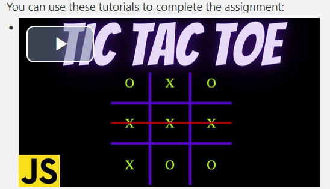

# Jane Doe - Terraform, EC2, TicTacToe report, AWS Elastic Beanstalk

- Course: *Cloud programming*
- Group:
- Date:

## Environment architecture

### Elastic Beanstalk

The backend application code as a zip file is uploded to the S3 bucket. After that, Elastic Beanstalk environment for backend is configured, specifying the application name, solution stack, version label, VPC ID, subnets... For this part, I followed instructions that described how to set up an Elastic Beanstalk environment manually through the AWS dashboard. Once the backend part is up and running, the frontend is configured in the same way. Ip address of the deployed backend is passed to the frontend as an envirnoment variable (PUBLIC_IP).

## Preview

Screenshots of configured AWS services. Screenshots of your application running.

## Reflections
In this lab, I learned how to deploy applications using AWS services: Elastic Beanstalk and Fargate. The PDF instructions provided were incredibly helpful in guiding me through the process of setting up the infrastructure using Terraform for both Elastic Beanstalk and Fargate because deploying sample applications manually through the AWS dashboard gave me a good understanding of the infrastructure before transitioning to Terraform automation. One significant challenge I faced was figuring out how to pass environment variables to the Dockerfile. At the end I created a separate sh script that is runnig from Dockerfile, and there I didn't have problem accessing env variables. 
I learned how to deploy 
- What did you learn?
- What obstacles did you overcome?
- What did you help most in overcoming obstacles?
- Was that something that surprised you?
